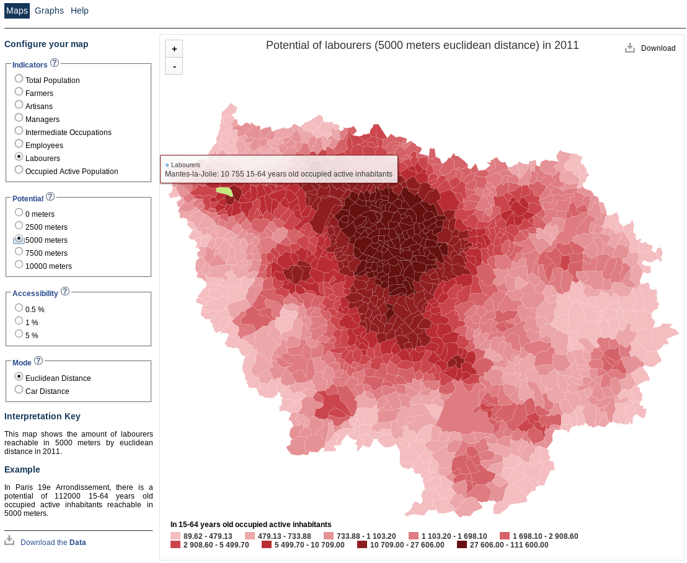

## Représentation et traitement de l'information géographique

1. Les API de cartographie

2. Représentations cartographiques

3. Opérations de géotraitements

4. Lissage spatial

5. Ressources


# Les API des cartographie


## Acquisition de fonds de carte statiques

Le package `ggmap`
```{r, cache=FALSE, warning=FALSE, eval=FALSE}
library(ggmap)
# téléchargement de la carte
mapIUT<- get_map(location = c(lon = 5.717324, lat = 45.192043),
                 color = "color",
                 source = "google",
                 maptype = "satellite",
                 zoom = 17)
# affichage de la carte
ggmap(mapIUT, extent = "device")
```


## 
```{r, echo = FALSE, message=FALSE, cache=TRUE}
library(ggmap)
# téléchargement de la carte
mapIUT<- get_map(location = c(lon = 5.717324, lat = 45.192043),
                 color = "color",
                 source = "google",
                 maptype = "satellite",
                 zoom = 17)
# affichage de la carte
ggmap(mapIUT, extent = "device")
```

## 
```{r, eval = FALSE}
library(ggmap)
# téléchargement de la carte
mapIUT<- get_map(location = c(lon = 5.717324, lat = 45.192043),
                 color = "color",
                 source = "google",
                 maptype = "roadmap",
                 zoom = 17)
# affichage de la carte et d'un marqueur sur le lieu de la conférence
library(ggplot2)
d <- data.frame(lat = 45.192043, lon = 5.717324, text ="4ème\nRencontres\nR")
p <- ggmap(mapIUT, extent = "device")
p <- p + geom_point(data=d, aes(x=lon, y=lat), color="red", size=8, alpha=1) 
p + annotate("text", x = d$lon, y = d$lat, label = d$text, col = "blue")
```

## 
```{r, echo = FALSE, message=FALSE, cache=TRUE}
library(ggmap)
# téléchargement de la carte
mapIUT<- get_map(location = c(lon = 5.717324, lat = 45.192043),
                 color = "color",
                 source = "google",
                 maptype = "roadmap",
                 zoom = 17)
# affichage de la carte et d'un marqueur sur le lieu de la conférence
library(ggplot2)
d <- data.frame(lat = 45.192043, lon = 5.717324, text ="4ème\nRencontres\nR")
p <- ggmap(mapIUT, extent = "device")
p <- p + geom_point(data=d, aes(x=lon, y=lat), color="red", size=8, alpha=1) 
p + annotate("text", x = d$lon, y = d$lat, label = d$text, col = "blue")
```

##
Le package `RgoogleMaps`
```{r, eval = FALSE}
library(RgoogleMaps)
# création des marqueurs
markers = paste0("&markers=color:blue|label:R|48.836016,2.372199")
# téléchargement de la carte
mapIUT <- GetMap(center = c( 45.192043,5.717324), zoom = 17, markers = markers,
                 destfile = "img/mapIUT.png")
# affichage de la carte
PlotOnStaticMap(mapIUT)
```

##
```{r, echo = FALSE, message=FALSE, fig.height=6, fig.width=6, cache=TRUE}
library(RgoogleMaps)
# création des marqueurs
markers = paste0("&markers=color:blue|label:R|45.192043,5.717324")
# téléchargement de la carte
mapIUT <- GetMap(center = c( 45.192043,5.717324), zoom = 17, markers = markers,
                 destfile = "img/mapIUT.png")
# affichage de la carte
PlotOnStaticMap(mapIUT)
```


##
Le package `OpenStreetMap`
```{r, eval=FALSE}
library(OpenStreetMap)
# téléchargement de la carte
mapIUT <- openmap(upperLeft = c(45.194303, 5.714051), 
                  lowerRight = c(45.189676, 5.722023), 
                  type = "osm")
# affichage de la carte
plot(mapIUT)

```

##
```{r, echo = FALSE, message=FALSE, fig.height=6, fig.width=6, cache=TRUE}
library(OpenStreetMap)
# téléchargement de la carte
mapIUT <- openmap(upperLeft = c(45.194303, 5.714051), 
                  lowerRight = c(45.189676, 5.722023), 
                  type = "osm")
# affichage de la carte
plot(mapIUT)

```


##
```{r, eval=FALSE}
library(OpenStreetMap)
# téléchargement de la carte
mapIUT <- openmap(upperLeft = c(45.194303, 5.714051), 
                  lowerRight = c(45.189676, 5.722023), 
                  type = "stamen-watercolor")
# affichage de la carte
plot(mapIUT)
# les cartes utilisent la projection mercator, il faut donc reprojeter 
# les points à afficher dans cette projection
rconf <- projectMercator(lat = 45.192043, long = 5.717324)
points(x = rconf[1], y = rconf[2], col = 'grey60', bg = "#920000", 
       pch = 21, cex = 2)
text(x = rconf[1], y = rconf[2], col = "#920000", font = 2,cex = 0.8, 
     labels = "4ème\nRencontres\nR",  adj = c(0.5,1.25))
```


##
```{r, echo = FALSE, message=FALSE, fig.height=6, fig.width=6, cache=TRUE}
library(OpenStreetMap)
# téléchargement de la carte
mapIUT <- openmap(upperLeft = c(45.194303, 5.714051), 
                  lowerRight = c(45.189676, 5.722023), 
                  type = "stamen-watercolor")
# affichage de la carte
plot(mapIUT)
# les cartes utilisent la projection mercator, il faut donc reprojeter 
# les points à afficher dans cette projection
rconf <- projectMercator(lat = 45.192043, long = 5.717324)
points(x = rconf[1], y = rconf[2], col = 'grey60', bg = "#920000", 
       pch = 21, cex = 2)
text(x = rconf[1], y = rconf[2], col = "#920000", font = 2,cex = 0.8, 
     labels = "4ème\nRencontres\nR",  adj = c(0.5,1.25))

```


## Affichage de cartes interactives
Le package `leaflet`
```{r, eval=FALSE}
library(leaflet)
# initialiser une carte
m <- leaflet()
# carte avec emprise mondiale
m <- addTiles(map = m)
# centrer sur un point
m <- setView(map = m, lng = 5.717324, lat = 45.192043, zoom = 15)
# ajout d'un pop-up
m <- addPopups(map = m, lng = 5.717324, lat = 45.192043, 
               popup = '<a href="http://r2015-grenoble.sciencesconf.org/">
               4ème rencontres R</a>')
# affichage de la carte
m
```


##
```{r, echo = FALSE, message=FALSE, fig.height=6, fig.width=6, cache=FALSE}
library(leaflet)
# initialiser une carte
m <- leaflet()
# carte avec emprise mondiale
m <- addTiles(map = m)
# centrer sur un point
m <- setView(map = m, lng = 5.717324, lat = 45.192043, zoom = 15)
# ajout d'un pop-up
m <- addPopups(map = m, lng = 5.717324, lat = 45.192043, 
               popup = '<a href="http://r2015-grenoble.sciencesconf.org/">
               4ème rencontres R</a>')
# affichage de la carte
m
```


## Géocodage
Des points à géocoder
```{r, echo = TRUE, message=FALSE, fig.height=6, fig.width=6, cache=FALSE}
# table des points d'intérêt à trouver
poi <- read.csv("data/poi.csv", colClasses = c("character", "character"))
poi
```


## 
Le package `ggmap`
```{r, echo = TRUE, message=FALSE, fig.height=6, fig.width=6, cache=FALSE}
# recherche des points d'intérêt
library(ggmap)
poigeo <- geocode(poi$adresse, output = "latlona")
poigeo <- cbind(poi, poigeo)
# affichage de la table avec les coordonnées
poigeo
```

##
```{r, eval=FALSE}
# affichage des points d'intérêt sur la carte
mapGre <- openmap(upperLeft = c(max(poigeo$lat)+0.001,min(poigeo$lon)-0.001), 
                  lowerRight = c(min(poigeo$lat)-0.001, max(poigeo$lon)+0.001), 
                  type = "osm")
# affichage de la carte
plot(mapGre)
poiproj <- projectMercator(lat = poigeo[,"lat"], long = poigeo[,"lon"])
points(x = poiproj[,1], y = poiproj[,2], col = 'grey60', bg = "#920000", 
       pch = 21, cex = 3)
text(x = poiproj[,1], y = poiproj[,2], col = "blue", 
     font = 2, labels = poigeo[,1], 
     adj = c(0,-1.25))
```

##
```{r, echo = FALSE, message=FALSE, fig.height=6, fig.width=6, cache=TRUE}
# affichage des points d'intérêt sur la carte
mapGre <- openmap(upperLeft = c(max(poigeo$lat)+0.001,min(poigeo$lon)-0.001), 
                  lowerRight = c(min(poigeo$lat)-0.001, max(poigeo$lon)+0.001), 
                  type = "osm")
# affichage de la carte
plot(mapGre)
poiproj <- projectMercator(lat = poigeo[,"lat"], long = poigeo[,"lon"])
points(x = poiproj[,1], y = poiproj[,2], col = 'grey60', bg = "#920000", 
       pch = 21, cex = 3)
text(x = poiproj[,1], y = poiproj[,2], col = "blue", 
     font = 2, labels = poigeo[,1], 
     adj = c(0,-1.25))
```


## Routage
Le package `ggmap`
```{r, eval=TRUE, echo = TRUE, message=FALSE, fig.height=6, fig.width=6, cache=FALSE}
# Trajet entre la gare et la conf
gare_conf <- route(from = as.numeric(poigeo[1,3:4]), 
                       to =  as.numeric(poigeo[3,3:4]), 
                       structure = 'leg', 
                       mode = "walking")
# affichage de la table du trajet
gare_conf
```


## 
```{r, eval=FALSE}
# conversion des coordonnées des points du trajet en mercator
gare_conf[, 7:8] <- projectMercator(lat = gare_conf[,8], long = gare_conf[, 7])
gare_conf[, 9:10] <- projectMercator(lat = gare_conf[,10], long = gare_conf[, 9])
# affichage de la carte
plot(mapGre)
# ajout du trajets
segments(x0 = gare_conf$startLon, y0 = gare_conf$startLat,
         x1 = gare_conf$endLon, y1 = gare_conf$endLat, 
         col= 'red', lwd = 3)
# affichage des points
text(x = poiproj[,1], y = poiproj[,2], col = "blue", 
     font = 2, labels = poigeo[,1], 
     adj = c(0,-1.25))
points(x = poiproj[,1], y = poiproj[,2], col = 'grey60', bg = "#920000", 
       pch = 21, cex = 3)
```

## 
```{r, echo = FALSE, message=FALSE, fig.height=6, fig.width=6, cache=TRUE}
gare_conf[, 7:8] <- projectMercator(lat = gare_conf[,8], long = gare_conf[, 7])
gare_conf[, 9:10] <- projectMercator(lat = gare_conf[,10], long = gare_conf[, 9])
conf_hotel <- route(from = as.numeric(poigeo[3,3:4]), 
                       to =  as.numeric(poigeo[2,3:4]), 
                       structure = 'leg', 
                       mode = "walking")

conf_hotel[, 7:8] <- projectMercator(lat = conf_hotel[,8], long = conf_hotel[, 7])
conf_hotel[, 9:10] <- projectMercator(lat = conf_hotel[,10], long = conf_hotel[, 9])
# affichage de la carte
plot(mapGre)
# ajout du trajets
segments(x0 = gare_conf$startLon, y0 = gare_conf$startLat,
         x1 = gare_conf$endLon, y1 = gare_conf$endLat, 
         col= 'red', lwd = 3)
segments(x0 = conf_hotel$startLon, y0 = conf_hotel$startLat,
         x1 = conf_hotel$endLon, y1 = conf_hotel$endLat, 
         col= 'green', lwd = 3)
# affichage des points
text(x = poiproj[,1], y = poiproj[,2], col = "blue", 
     font = 2, labels = poigeo[,1], 
     adj = c(0,-1.25))
points(x = poiproj[,1], y = poiproj[,2], col = 'grey60', bg = "#920000", 
       pch = 21, cex = 3)
```

##
Le package `ggmap`
```{r, echo = TRUE, message=FALSE, fig.height=6, fig.width=6, cache=FALSE}
# calcul de distances et temps entre la conf et la gare et l'hotel
x <- mapdist(from = poigeo$adress[3], poigeo$adress[c(1,2)], mode = 'walking', 
             output = "simple")
# affichage de la table des distances
x[,c(1,2,4,7)]
```


## Attention {.smaller}

*The Geocoding API may only be used in conjunction with a Google map; geocoding results without displaying them on a map is prohibited.*   
[https://developers.google.com/maps/documentation/geocoding/](https://developers.google.com/maps/documentation/geocoding/)   

*The Directions API may only be used in conjunction with displaying results on a Google map; using Directions data without displaying a map for which directions data was requested is prohibited.*    
[https://developers.google.com/maps/documentation/directions/](https://developers.google.com/maps/documentation/directions/)  

*Use of the Distance Matrix API must relate to the display of information on a Google Map; for example, to determine origin-destination pairs that fall within a specific driving time from one another, before requesting and displaying those destinations on a map. Use of the service in an application that doesn't display a Google map is prohibited.*  
[https://developers.google.com/maps/documentation/distancematrix/](https://developers.google.com/maps/documentation/distancematrix/)  


## Alternatives libres

### Pour le géocodage :  
* [Nominatim](http://wiki.openstreetmap.org/wiki/Nominatim)  
* [photon](http://photon.komoot.de/)  
* [MapQuest Open Geocoding API](http://developer.mapquest.com/fr/web/products/open/geocoding-service), basé sur Nominatim   
* [GeoNames](http://www.geonames.org/export/web-services.html), et package `geonames`   

### Pour le routage :  
* [GraphHopper](https://graphhopper.com/)        
* [Open Source Routing Machine (OSRM)](http://project-osrm.org/)    

**Possibilité de traitements massifs, sous réserve d'installation locale.**

## Avec OSRM
```{r, echo = TRUE, message=FALSE, fig.height=6, fig.width=6, cache=FALSE}
# Import de la matrice de distances créée via un appel à l'API d'OSRM
roadDist <- read.csv("data/matrix/matmin.csv", 
                         check.names = FALSE, 
                         row.names = 1)
# Matrice de distances en minutes
roadDist[1:10, 1:10]
```


##
```{r, echo = TRUE, eval=FALSE, message=FALSE, fig.height=6, fig.width=6, cache=FALSE}
# Selection des distances à partir de montreuil
roadDistMontreuil <-  data.frame(id = colnames(roadDist), 
                                 t(roadDist[row.names(roadDist) == "93048", ]))
names(roadDistMontreuil)[2] <- "dist"
# Import du fond de carte communal d'IDF
library(rgdal)
comidf.spdf <- readOGR(dsn = "data/map/", layer = "map",verbose = F)
# Cartographie
library(cartography)
cols <- carto.pal(pal1 = "red.pal", n1 = 6, pal2 = "turquoise.pal", n2 = 3)
par(mar=c(0,0,1.2,0))
choroLayer(spdf = comidf.spdf, df = roadDistMontreuil, col = cols,
           legend.title.txt = "Temps d'accès\n(en minutes)", legend.pos = "topleft",
           legend.title.cex = 0.7, border = "grey50",
           var = "dist", 
           distr = seq(0,90,10), add=F)
layoutLayer(title = "Accessibilité aux communes d'IDF depuis Montreuil en voiture",
            sources = "OpenStreet Map, 2015", author = "T. Giraud", 
            frame = T, south = T)

```

##
```{r, echo = FALSE, message=FALSE, fig.height=6, fig.width=8, cache=TRUE,comment=FALSE,  warning=FALSE, error=FALSE}
# Selection des distances à partir de montreuil
roadDistMontreuil <-  data.frame(id = colnames(roadDist), 
                                 t(roadDist[row.names(roadDist) == "93048", ]))
names(roadDistMontreuil)[2] <- "dist"
# Import du fond de carte communal d'IDF
library(rgdal)
comidf.spdf <- readOGR(dsn = "data/map/", layer = "map",verbose = F)
# Cartographie
library(cartography)
cols <- carto.pal(pal1 = "red.pal", n1 = 6, pal2 = "turquoise.pal", n2 = 3)
par(mar=c(0,0,1.2,0))
choroLayer(spdf = comidf.spdf, df = roadDistMontreuil, col = cols,
           legend.title.txt = "Temps d'accès\n(en minutes)", legend.pos = "topleft",
           legend.title.cex = 0.7, border = "grey50",
           var = "dist", 
           breaks = seq(0,90,10), add=F)
layoutLayer(title = "Accessibilité aux communes d'IDF depuis Montreuil en voiture",
            sources = "OpenStreet Map, 2015", author = "T. Giraud", 
            frame = T, south = T)

```

# Cartographie


## Les indispensables


Le package `sp` : manipulation et affichage des objets spatiaux.  


Le package `rgdal` : import/export des objets spatiaux et gestion des projections cartographiques.  


## 
Jeu de données : répartition des groupes sociaux en Île-de-France
```{r, echo = TRUE, message=FALSE, fig.height=6, fig.width=6, cache=FALSE}
comidf <- read.csv("data/dataset/data.csv")
head(comidf)
```


## Cartographie en symboles proportionnels
Le package `cartography`
```{r, echo = TRUE, eval=FALSE, message=FALSE, fig.height=6, fig.width=8, cache=TRUE,comment=FALSE,  warning=FALSE, error=FALSE}
# Affichage du fond de carte
par(mar=c(0,0,1.2,0))
plot(comidf.spdf, border = NA, col = "#9BCBAE")

library(cartography)
# Affichage des effectifs de la population active occupée
propSymbolsLayer(spdf = comidf.spdf, df = comidf, var = "total", 
                 k = 0.001 ,legend.style = "b", 
                 legend.pos = "left", legend.values.cex = 0.5,
                 legend.title.cex = 0.7,
                 legend.title.txt = "Population active\noccupée en 2011")
layoutLayer(title = "Répartition de la population active occupée en IDF", 
            sources = "INSEE, 2011", author = "T. Giraud", south = T)

```


##
```{r, echo = FALSE, message=FALSE, fig.height=6, fig.width=8, cache=TRUE,comment=FALSE,  warning=FALSE, error=FALSE}
# Affichage du fond de carte
par(mar=c(0,0,1.2,0))
plot(comidf.spdf, border = NA, col = "#9BCBAE")
library(cartography)
# Affichage des effectids de la population active occupée
propSymbolsLayer(spdf = comidf.spdf, df = comidf, var = "total", 
                 k = 0.001 ,legend.style = "e", 
                 legend.pos = "left", legend.values.cex = 0.5,
                 legend.title.cex = 0.7,
                 legend.title.txt = "Population active\noccupée en 2011")
layoutLayer(title = "Répartition de la population active occupée en IDF", 
            sources = "INSEE, 2011", author = "T. Giraud", south = T)

```

## Autre symbologie
```{r, echo = TRUE, eval=FALSE, message=FALSE, fig.height=6, fig.width=8, cache=TRUE,comment=FALSE,  warning=FALSE, error=FALSE}
# Affichage du fond de carte
par(mar=c(0,0,1.2,0))
# limites de paris
paris <- comidf.spdf[substr(comidf.spdf$ID, 1,2)==75,]
parisC <- rgeos::gUnaryUnion(paris)
# cartographie
plot(parisC, border = "red", lwd = 2, add = F)
plot(comidf.spdf, border = "white", col = "#9BCBAE", lwd = 0.5, add=T)
plot(parisC, border = "red", lwd = 2, add = T)
layoutLayer(title = "Répartition de la population active à Paris", 
            sources = "INSEE, 2011", author = "T. Giraud", south = T)
# Affichage des effectifs de la population active occupée
propSymbolsLayer(spdf = paris, df = comidf, var = "total", 
                 k = 0.01 ,legend.style = "c", symbols = "squares",
                 legend.pos = "topleft", legend.values.cex = 0.5,
                 legend.title.cex = 0.7, col = "#920000", legend.frame = T,
                 legend.title.txt = "Population active\noccupée en 2011")
```

##
```{r, echo = FALSE, eval=TRUE, message=FALSE, fig.height=6, fig.width=8, cache=TRUE,comment=FALSE,  warning=FALSE, error=FALSE}
# Affichage du fond de carte
par(mar=c(0,0,1.2,0))
# limites de paris
paris <- comidf.spdf[substr(comidf.spdf$ID, 1,2)==75,]
parisC <- rgeos::gUnaryUnion(paris)
# cartographie
plot(parisC, border = "red", lwd = 2, add = F)
plot(comidf.spdf, border = "white", col = "#9BCBAE", lwd = 0.5, add=T)
plot(parisC, border = "red", lwd = 2, add = T)
layoutLayer(title = "Répartition de la population active à Paris", 
            sources = "INSEE, 2011", author = "T. Giraud", south = T)
# Affichage des effectifs de la population active occupée
propSymbolsLayer(spdf = paris, df = comidf, var = "total", 
                 k = 0.01 ,legend.style = "c", symbols = "squares",
                 legend.pos = "topleft", legend.values.cex = 0.5,
                 legend.title.cex = 0.7, col = "#920000", legend.frame = T,
                 legend.title.txt = "Population active\noccupée en 2011")
```

## Cartographie choroplèthe
Le package `cartography`
```{r, echo = TRUE,eval = FALSE, message=FALSE, fig.height=6, fig.width=8, cache=TRUE,comment=FALSE,  warning=FALSE, error=FALSE}
# Calcul de la part des ouvriers dans la population active occupée
comidf$partouvrier <- comidf$ouvrier/comidf$total * 100

# Affichage du fond de carte
cols <- carto.pal(pal1 = "turquoise.pal", n1 = 6)
par(mar=c(0,0,1.2,0))
layoutLayer(title = "Répartition des ouvriers en IDF",col = "#080E5B",
            sources = "Insee, 2011", author = "T. Giraud", 
            frame = T, north = T, extent = comidf.spdf)
choroLayer(spdf = comidf.spdf, df = comidf, col = cols, border = "grey50",
           legend.title.txt = "Part des ouvriers\n(en %)", legend.pos = "topleft",
           legend.title.cex = 0.7, 
           var = "partouvrier", nclass = 6,
           method = "quantile", add=T)
```

##
```{r, echo = FALSE, message=FALSE, fig.height=6, fig.width=8, cache=TRUE,comment=FALSE,  warning=FALSE, error=FALSE}

# Calcul de la part des ouvriers dans la population active occupée
comidf$partouvrier <- comidf$ouvrier/comidf$total * 100

# Affichage du fond de carte
cols <- carto.pal(pal1 = "turquoise.pal", n1 = 6)
par(mar=c(0,0,1.2,0))
layoutLayer(title = "Répartition des ouvriers en IDF",col = "#080E5B",
            sources = "Insee, 2011", author = "T. Giraud", 
            frame = T, north = T, extent = comidf.spdf)
choroLayer(spdf = comidf.spdf, df = comidf, col = cols, border = "grey50",
           legend.title.txt = "Part des ouvriers\n(en %)", legend.pos = "topleft",
           legend.title.cex = 0.7, 
           var = "partouvrier", nclass = 6,
           method = "quantile", add=T)
```


# Géotraitements

## L'indispensable

Le package `rgeos` donne accès à la librairie d'opérations spatiales GEOS ([Geometry Engine - Open Source](http://trac.osgeo.org/geos/)).  

* Area / Perimeter 
* Distances  
* Buffer
* Overlap / intersect / difference
* Contains / within
* Union
* ...

## Exemple avec un semis de points
```{r, echo = TRUE, eval=FALSE, message=FALSE, fig.height=6, fig.width=6, cache=TRUE,comment=FALSE,  warning=FALSE, error=FALSE}
# import des données
load("data/tweets.RData")
data(nuts2006)
# affichage des tweets 
par(mar = c(0,0,1.2,0))
plot(frame.spdf, col = "#A2C4F5", add= F, border = NA)
plot(graticule.spdf, add=T, border = "white", lwd = 0.5)
plot(countries.spdf, col = "grey50", border = NA, add=T)
plot(nuts0.spdf, add=T, col = "black", border = "grey50", lwd = 0.5)
plot(coasts.spdf, col = '#DCE8FA', add=T)
plot(marseillegeo, col = '#1A7832', pch = ".", add=T)
layoutLayer(frame = F, title = 'Tweets citant Marseille',
            sources = "DMI - Amsterdam, 2015",
            author = "T. Giraud",
            south = T, scale = NULL)
text(x = 5564810,y = 4098997, labels = "Chaque point représente\nun tweet", 
     pos = 4, cex = 0.8, col = "white" )
```


##
```{r, echo = FALSE, message=FALSE, fig.height=6, fig.width=6, cache=TRUE,comment=FALSE,  warning=FALSE, error=FALSE}
# import des données
data(nuts2006)
load("data/tweets.RData")
# affichage des tweets 
par(mar = c(0,0,1.2,0))
plot(frame.spdf, col = "#A2C4F5", add= F, border = NA)
plot(graticule.spdf, add=T, border = "white", lwd = 0.5)
plot(countries.spdf, col = "grey50", border = NA, add=T)
plot(nuts0.spdf, add=T, col = "black", border = "grey50", lwd = 0.5)
plot(coasts.spdf, col = '#DCE8FA', add=T)
plot(marseillegeo, col = '#1A7832', pch = ".", add=T)
layoutLayer(frame = F, title = 'Tweets citant Marseille',
            sources = "DMI - Amsterdam, 2015",
            author = "T. Giraud",
            south = T, scale = NULL)
text(x = 5564810,y = 4098997, labels = "Chaque point représente\nun tweet", 
     pos = 4, cex = 0.8, col = "white" )
```

## Compter des points dans des polygones 
```{r, echo = TRUE, fig.height=6, fig.width=8, cache=TRUE}
# intersection des tweets et des pays
tweetsInNuts0 <- over(x = marseillegeo, y = nuts0.spdf)
tweetsInNuts0$nb <- 1
# comptage des tweets dans les polygones
tweetspercountry <- aggregate(x = tweetsInNuts0$nb, 
                              by = list(tweetsInNuts0$name), 
                              FUN = sum)
names(tweetspercountry) <- c("name", "nbtweets")
head(tweetspercountry[order(tweetspercountry$nbtweets, decreasing = T),])
```

## Création d'une grille régulière de polygones
```{r, echo = TRUE, eval=FALSE, message=FALSE, fig.height=6, fig.width=8, cache=TRUE,comment=FALSE,  warning=FALSE, error=FALSE}
# création d'une grille de points
hexapoints <- spsample(x = nuts0.spdf, cellsize = 40000, type = 'hexagonal')
# transformation en grille de polygones
hexapoly <- HexPoints2SpatialPolygons(hex = hexapoints)
datahexa <- data.frame(id = row.names(hexapoly), x = 1)
row.names(datahexa) <- datahexa$id
hexapoly <- SpatialPolygonsDataFrame(Sr = hexapoly, data = datahexa)
# affichage des hexagones
par(mar = c(0,0,0,0))
plot(hexapoly)
```

##
```{r, echo = FALSE, eval=TRUE, message=FALSE, fig.height=6, fig.width=8, cache=TRUE,comment=FALSE,  warning=FALSE, error=FALSE}
# création d'une grille de points
hexapoints <- spsample(x = nuts0.spdf, cellsize = 40000, type = 'hexagonal')
# transformation en grille de polygones
hexapoly <- HexPoints2SpatialPolygons(hex = hexapoints)
datahexa <- data.frame(id = row.names(hexapoly), x = 1)
row.names(datahexa) <- datahexa$id
hexapoly <- SpatialPolygonsDataFrame(Sr = hexapoly, data = datahexa)
# affichage des hexagones
par(mar = c(0,0,0,0))
plot(hexapoly)
```


## Compter les points dans les polygones
```{r, echo = TRUE, eval=TRUE, message=FALSE, fig.height=6, fig.width=8, cache=TRUE,comment=FALSE,  warning=FALSE, error=FALSE}
# intersection entre les polygones et les tweets
tweetsInHexaPoly <- over(x = marseillegeo, y = hexapoly)
# comptage des tweets dans les polygones
marseilletweethexapoly <- aggregate(x = tweetsInHexaPoly$x, 
                                    by = list(tweetsInHexaPoly$id), FUN = sum)
names(marseilletweethexapoly) <- c("id", "n")
```

## Cartographie
```{r, echo = TRUE, eval = FALSE, message=FALSE, fig.height=6, fig.width=8, cache=TRUE,comment=FALSE,  warning=FALSE, error=FALSE}
# cartographie des polygones
par(mar = c(0,0,1.2,0))
plot(nuts0.spdf, col = "grey60", border = NA)
choroLayer(spdf = hexapoly, df = marseilletweethexapoly, 
           var = "n", border = NA, method = "geom", 
           nclass = 5, legend.pos = "right",
           col = c("#B8D9A9" ,"#8DBC80" ,"#5D9D52" ,
                   "#287A22" ,"#17692C"),
           legend.title.txt = "Nombre de tweets")
layoutLayer(frame = F, title = 'Tweets citant Marseille',
            sources = "DMI - Amsterdam, 2015",
            author = "T. Giraud",
            south = T, scale = NULL)
```


##
```{r, echo = FALSE, message=FALSE, fig.height=6, fig.width=8, cache=TRUE,comment=FALSE,  warning=FALSE, error=FALSE}
# cartographie des polygones
par(mar = c(0,0,1.2,0))
plot(nuts0.spdf, col = "grey60", border = NA)
choroLayer(spdf = hexapoly, df = marseilletweethexapoly, 
           var = "n", border = NA, method = "geom", 
           nclass = 5, legend.pos = "right",
           col = c("#B8D9A9" ,"#8DBC80" ,"#5D9D52" ,
                   "#287A22" ,"#17692C"),
           legend.title.txt = "Nombre de tweets")
layoutLayer(frame = F, title = 'Tweets citant Marseille',
            sources = "DMI - Amsterdam, 2015",
            author = "T. Giraud",
            south = T, scale = NULL)
```


## Extraire des frontières et étudier les discontinuités
```{r, echo = FALSE, eval = TRUE, prompt=FALSE, message=FALSE, fig.height=5, fig.width=5, cache=FALSE, comment=FALSE,  warning=FALSE, error=FALSE}
library(cartography)
data(nuts2006)
plot(nuts0.spdf, border = "white", col = "grey60")

```


##
```{r, echo = TRUE,eval = FALSE, prompt=FALSE, message=FALSE, fig.height=6, fig.width=8, cache=TRUE, comment=FALSE,  warning=FALSE, error=FALSE}
data(nuts2006)
nuts0.contig.spdf <- getBorders(nuts0.spdf)
nuts0.contig.spdf$col <- sample(x = rainbow(96))
plot(nuts0.spdf, border = NA, col = "grey60")
plot(nuts0.contig.spdf, col = nuts0.contig.spdf$col, lwd = 3, add=T)
layoutLayer(title = 'Frontières inter-étatiques terrestres',
            author = "T. Giraud", sources = "",
            south = T, scale = NULL)
```

##
```{r, echo = FALSE, eval = TRUE, prompt=FALSE, message=FALSE, fig.height=6, fig.width=8, cache=TRUE, comment=FALSE,  warning=FALSE, error=FALSE}
data(nuts2006)
nuts0.contig.spdf <- getBorders(nuts0.spdf)
nuts0.contig.spdf$col <- sample(x = rainbow(nrow(nuts0.contig.spdf)))
par(mar = c(0, 0, 1.2, 0))
plot(nuts0.spdf, border = NA, col = "grey60")
plot(nuts0.contig.spdf, col = nuts0.contig.spdf$col, lwd = 3, add=T)
layoutLayer(title = 'Frontières inter-étatiques terrestres',
            author = "T. Giraud", sources = "",
            south = T, scale = NULL)
```

## 
Fonction `getBorders` du package `cartography` :

* gBuffer (créer des zones tampons)
* gInterserction (créer une couche d'intersections)
* gDisjoint (tester l'existence d'intersections)
* gBoundary (extraire des contours)


## Cartographie
```{r, echo = TRUE,eval = FALSE, prompt=FALSE, message=FALSE, fig.height=6, fig.width=8, cache=TRUE, comment=FALSE,  warning=FALSE, error=FALSE}
nuts0.df$gdphab <- nuts0.df$gdppps2008 * 1000000 / nuts0.df$pop2008
par(mar = c(0,0,1.2,0))
choroLayer(spdf = nuts0.spdf, df = nuts0.df, 
           var = "gdphab", method = "q6",
           legend.title.txt = "PIB par habitants\n(en euros)",  
           legend.values.rnd = 0, legend.pos = "topright", add=F)
plot(nuts0.spdf, col=NA, lwd=1, border="white", add=T)
discLayer(spdf = nuts0.contig.spdf, df = nuts0.df, 
          dfid = "id", spdfid1 = "id1", spdfid2 = "id2",
          var = "gdphab", col="red", nbclass=5, 
          legend.pos = "right", legend.values.rnd = 0,
          legend.title.txt = "Différentiel de \nPIB par habitants", 
          method="equal", threshold = 0.5, sizemin = 1,
          sizemax = 8, type = "abs", add=TRUE )
layoutLayer(title = 'Différentiels de richesse en Europe',
            author = "T. Giraud", sources = "Eurostat, 2008",
            scale = NULL)

```

##
```{r, echo = FALSE, prompt=FALSE, message=FALSE, fig.height=6, fig.width=8, cache=TRUE, comment=FALSE,  warning=FALSE, error=FALSE}
nuts0.df$gdphab <- nuts0.df$gdppps2008 * 1000000 / nuts0.df$pop2008
par(mar = c(0,0,1.2,0))
choroLayer(spdf = nuts0.spdf, df = nuts0.df, 
           var = "gdphab", method = "q6",
           legend.title.txt = "PIB par habitants\n(en euros)",  
           legend.values.rnd = 0, legend.pos = "topright", add=F)
plot(nuts0.spdf, col=NA, lwd=1, border="white", add=T)
discLayer(spdf = nuts0.contig.spdf, df = nuts0.df, 
          dfid = "id", spdfid1 = "id1", spdfid2 = "id2",
          var = "gdphab", col="red", nbclass=5, 
          legend.pos = "right", legend.values.rnd = 0,
          legend.title.txt = "Différentiel de \nPIB par habitants", 
          method="equal", threshold = 0.5, sizemin = 1,
          sizemax = 8, type = "abs", add=TRUE )
layoutLayer(title = 'Différentiels de richesse en Europe',
            author = "T. Giraud", sources = "Eurostat, 2008",
            scale = NULL)
```


## Mais aussi...
Des liens sont possibles avec des **SIG** ou des **bases de données spatiales** :  

* GRASS (`spgrass6`, `rgrass7`)  
* QGIS (via Processing, anciennement sextante)  
* ArcGis (`RPyGeo` via Python)   
* PostGis / PostGreSQl (`RPostgreSQL`)  


# Lissage spatial


## Le package `SpatialPosition`
Des modèles d’interaction spatiale permettant de saisir l’influence exercée par un lieu sur tous les autres.

Le modèle de Stewart (accessibilité potentielle, potentiel gravitationnel ou accessibilité gravitationnelle) :

$$
A_i = \sum_{j=1}^n O_j f(d_{ij})
$$

- $A_i$ potentiel en $i$
- $O_j$ stock de population sur $j$ 
- $f(d_{ij})$ fonction négative de la distance entre $i$ et $j$

## Exemple sur la capacité des hopitaux parisiens
```{r, echo = TRUE, eval = FALSE, message=FALSE, fig.height=6, fig.width=8, cache=TRUE,comment=FALSE,  warning=FALSE, error=FALSE}
library(cartography)
library(SpatialPosition)
data(spatData)
par(mar = c(0,0,1.2,0))
plot(spatMask, col = "grey70")
propSymbolsLayer(spdf = spatPts, df = spatPts@data, var = "Capacite", 
                 legend.title.txt = "Nb. de lits", col = "#920000", 
                 legend.pos = "topleft")
layoutLayer(title = "Répartitions des hopitaux parisiens", south = T, 
            scale = 2)
```


## 
```{r, echo = FALSE, eval = TRUE, message=FALSE, fig.height=6, fig.width=8, cache=TRUE,comment=FALSE,  warning=FALSE, error=FALSE}
library(cartography)
library(SpatialPosition)
data(spatData)
par(mar = c(0,0,1.2,0))
plot(spatMask, col = "grey70")
propSymbolsLayer(spdf = spatPts, df = spatPts@data, var = "Capacite", 
                 legend.title.txt = "Nb. de lits", col = "#920000", 
                 legend.pos = "topleft")
layoutLayer(title = "Répartitions des hopitaux parisiens", south = T, 
            scale = 2)
```


## Calcul des potentiels
```{r, echo = TRUE, eval=FALSE, message=FALSE, fig.height=6, fig.width=8, cache=TRUE,comment=FALSE,  warning=FALSE, error=FALSE}
hopPot <- stewart(knownpts = spatPts, varname = "Capacite",
                  typefct = "exponential", span = 1000, beta = 3,
                  resolution = 200, 
                  mask = spatMask)
plot(spatMask, col = "grey70")
plot(hopPot, cex = 0.5, add=T)
```

##
```{r, echo=FALSE, eval=TRUE, message=FALSE, fig.height=6, fig.width=8, cache=TRUE,comment=FALSE,  warning=FALSE, error=FALSE}
# Calcul de l'accessibilité
hopPot <- stewart(knownpts = spatPts, varname = "Capacite",
                  typefct = "exponential", span = 1000, beta = 3,
                  resolution = 200, 
                  mask = spatMask)
plot(spatMask, col = "grey70")
plot(hopPot, cex = 0.5, add=T)
```

## Affichage de la carte
```{r, echo = TRUE, eval=FALSE, message=FALSE, fig.height=6, fig.width=8, cache=TRUE,comment=FALSE,  warning=FALSE, error=FALSE}
# création d'un raster
rasterAccessibility <- rasterStewart(x = hopPot, mask = spatMask)
# Affichage du raster
par(mar=c(0,0,1.2,2))
breakValues <- plotStewart(x = rasterAccessibility, add = F, nclass = 6)
# Create contour lines and add them to the plot
contLines <- contourStewart(x = rasterAccessibility, breaks = breakValues)
plot(contLines, add = TRUE)
plot(spatMask, add = TRUE)
sources <-  "Potential nb. of beds\ndistance function: exponential,\nspan = 1 km, beta = 3"
layoutLayer(title = "Global Accessibility to Public Hospitals", 
            frame = FALSE, sources = sources, 
            author = "", coltitle = "black", col = NA)
```


## 
```{r, echo = FALSE, eval = TRUE, message=FALSE, fig.height=6, fig.width=8, cache=TRUE,comment=FALSE,  warning=FALSE, error=FALSE}
# création d'un raster
rasterAccessibility <- rasterStewart(x = hopPot, mask = spatMask)
# Affichage du raster
par(mar=c(0,0,1.2,2))
breakValues <- plotStewart(x = rasterAccessibility, add = F, nclass = 6)
# Create contour lines and add them to the plot
contLines <- contourStewart(x = rasterAccessibility, breaks = breakValues)
plot(contLines, add = TRUE)
plot(spatMask, add = TRUE)
sources <-  "Potential nb. of beds\ndistance function: exponential,\nspan = 1 km, beta = 3"
layoutLayer(title = "Global Accessibility to Public Hospitals", 
            frame = FALSE, sources = sources, 
            author = "", coltitle = "black", col = NA)
```


## Exemple dans un maillage et avec une matrice de distances
Préparation des données
```{r, echo = TRUE, message=FALSE, fig.height=6, fig.width=8, cache=TRUE,comment=FALSE,  warning=FALSE, error=FALSE}
library(SpatialPosition)
# Jointure fond de carte / données
comidf.spdf@data <- data.frame(comidf.spdf@data, 
                               comidf[match(comidf.spdf@data$ID,comidf$ID), ])
row.names(comidf.spdf) <- as.character(comidf.spdf@data$ID)
# Ordonner les lignes et les colonnes de la matrice
roadDist <- roadDist[comidf.spdf$ID, comidf.spdf$ID]
```

## Calcul des potentiels
```{r, echo = TRUE, eval = TRUE,  message=FALSE, fig.height=6, fig.width=8, cache=TRUE,comment=FALSE,  warning=FALSE, error=FALSE}
# Potentiel d'ouvriers dans un voisinnage de 7 minutes
ouv <- stewart(knownpts = comidf.spdf, unknownpts = comidf.spdf, 
               matdist = roadDist, typefct = "exponential",
               varname = "ouvrier", span = 7, beta = 3)
# Potentiel de population active dans un voisinnage de 7 minutes
tot <- stewart(knownpts = comidf.spdf, unknownpts = comidf.spdf, 
               matdist = roadDist, typefct = "exponential",
               varname = "total", span = 7, beta = 3)
pot <- data.frame(id = tot$ID, partouvrierpot = ouv$OUTPUT/tot$OUTPUT * 100)
```

## Cartographie
```{r, echo = TRUE, eval = FALSE,  message=FALSE, fig.height=6, fig.width=8, cache=TRUE,comment=FALSE,  warning=FALSE, error=FALSE}
par(mar=c(0,0,1.2,0))
cols <- carto.pal(pal1 = "turquoise.pal", n1 = 6)
choroLayer(spdf = comidf.spdf, df = pot, col = cols,border = "grey50",
           legend.title.txt = "Part des ouvriers\n(en %)*", 
           legend.pos = "left",
           legend.title.cex = 0.7, 
           var = "partouvrierpot", nclass = 6,
           method = "quantile", add=F)
titre <- "Répartition des ouvriers en IDF - Voisinnage fonctionnel de 7 minutes en voiture"
layoutLayer(title = titre,
            col = "#080E5B",
            sources = "* Fonction d'interaction spatiale : exponentielle
            Facteur d'impédence (beta) : 3
            Portée : 7 minutes
            Sources : Insee, 2011; OpenStreet Map, 2015 ", author = "T. Giraud", 
            frame = T, south = T)

```


##
```{r, echo = FALSE, eval = TRUE,  message=FALSE, fig.height=6, fig.width=8, cache=TRUE,comment=FALSE,  warning=FALSE, error=FALSE}
# Cartographie
par(mar=c(0,0,1.2,0))
cols <- carto.pal(pal1 = "turquoise.pal", n1 = 6)
choroLayer(spdf = comidf.spdf, df = pot, col = cols,border = "grey50",
           legend.title.txt = "Part des ouvriers\n(en %)*", 
           legend.pos = "left",
           legend.title.cex = 0.7, 
           var = "partouvrierpot", nclass = 6,
           method = "quantile", add=F)
cols <- carto.pal(pal1 = "turquoise.pal", n1 = 6)
titre <- "Répartition des ouvriers en IDF - Voisinnage fonctionnel de 7 minutes en voiture"
layoutLayer(title = titre,
            col = "#080E5B",
            sources = "* Fonction d'interaction spatiale : exponentielle
 Facteur d'impédence (beta) : 3
 Portée : 7 minutes
 Sources : Insee, 2011; OpenStreet Map, 2015 ", author = "T. Giraud", 
            frame = T, south = T)


```

##
```{r, echo = FALSE, eval = TRUE,  message=FALSE, fig.height=5, fig.width=10, cache=TRUE,comment=FALSE,  warning=FALSE, error=FALSE}
# Cartographie
par(mar=c(0,0,1.2,0.1), mfrow = c(1,2))
cols <- carto.pal(pal1 = "turquoise.pal", n1 = 6)
choroLayer(spdf = comidf.spdf, df = comidf, col = cols,border = "grey50",
           legend.title.txt = "Part des ouvriers\n(en %)", 
           legend.pos = "bottomleft",
           legend.title.cex = 0.7, 
           var = "partouvrier", nclass = 6,
           method = "quantile", add=F)
layoutLayer(title = "Répartition des ouvriers en IDF - Sans lissage", sources = "", author = "")
choroLayer(spdf = comidf.spdf, df = pot, col = cols,border = "grey50",
           legend.title.txt = "Part des ouvriers\ndans un voisinnage\nfonctionnel \nde 7 minutes(en %)", 
           legend.pos = "bottomleft",
           legend.title.cex = 0.7, 
           var = "partouvrierpot", nclass = 6,
           method = "quantile", add=F)
layoutLayer(title = "Répartition des ouvriers en IDF - Avec lissage", sources = "", author = "")
```


## Représentation continue
```{r, echo = FALSE, message=FALSE, fig.height=5.5, fig.width=8.5, cache=TRUE,comment=FALSE,  warning=FALSE, error=FALSE}
# Création d'une grille de points
gridpts <- CreateGrid(w = comidf.spdf, resolution = 2000)

# Selection des points dans les pays (pour alleger les calculs)
gridptscom <- gridpts[!is.na(over(gridpts, comidf.spdf)$ID),]

# Création de la matrice de distance
mat <- CreateDistMatrix(knownpts = comidf.spdf, unknownpts = gridptscom)

# Calcul des potentiels 
ouv <- stewart(knownpts = comidf.spdf,
               unknownpts = gridptscom, 
               matdist = mat, 
               varname = 'ouvrier', 
               typefct = "exponential", 
               span = 7500,
               beta = 3)

# Ajouts valeurs des potentiels à la grille complète
gridouv <- gridpts
gridouv@data <- data.frame(gridouv@data, 
                           OUTPUT = ouv@data[match(x = gridpts@data$ID, 
                                                   table = ouv@data$ID ),
                                             "OUTPUT"])
gridouv@data[is.na(gridouv@data$OUTPUT),"OUTPUT"] <- 0

# Transformation de la grille de points en raster
rasterouv <- rasterStewart(x = gridouv)

# Calcul des potentiels 
tot <- stewart(knownpts = comidf.spdf,
               unknownpts = gridptscom, 
               matdist = mat, 
               varname = 'total', 
               typefct = "exponential", 
               span = 7500,
               beta = 3)

# Ajouts valeurs des potentiels à la grille complète
gridtot <- gridpts
gridtot@data <- data.frame(gridtot@data, 
                           OUTPUT = tot@data[match(x = gridpts@data$ID, 
                                                   table = tot@data$ID ),
                                             "OUTPUT"])
gridtot@data[is.na(gridtot@data$OUTPUT),"OUTPUT"] <- 0

# Transformation de la grille de points en raster
rastertot <- rasterStewart(x = gridtot)

rasterpot <- rasterouv/rastertot
rasterpot[is.na(rasterpot)] <- 0

bks <- seq(0,0.4, 0.05)
# Création d'un SpatialPolygonDataFrame des contours
contourpot <- contourStewart(x = rasterpot, breaks = bks, type = "poly")

# Gestion des couleurs
cols <-c( "#95C2AC", 
         "#85ACA7", "#7190A1", "#5B739B", 
         "#435490", "#253175")

contourpot@data$cols <- contourpot@data$levels

levels(contourpot@data$cols)[order(as.numeric(levels(contourpot@data$cols)), 
                                   decreasing = F)] <- cols
# Affichage de la carte
# png('repartition.png', width = 715, height = 350)
par (mar = c(0,0,1.2,0))
plot(contourpot, add=F,border = "grey50", 
     col = as.character(contourpot@data$cols) , lwd= 0.25)

LegendChoro(pos = "left", legTitle = "Part des ouvriers\n(en %)*",
  legTitleCex = 0.8, legValuesCex = 0.6, distr = seq(0.05,0.35, 0.05)*100, 
  cols = cols, round = 0, nodata = FALSE)

titre <- "Répartition des ouvriers en IDF - Voisinnage fonctionnel de 7,5 km"
layoutLayer(title = titre,
            col = "#080E5B",
            sources = "* Fonction d'interaction spatiale : exponentielle
 Facteur d'impédence (beta) : 3
 Portée : 7500 mètres
 Sources : Insee, 2011; OpenStreet Map, 2015 ", author = "T. Giraud", 
            frame = T, south = T)

```

## Applications web

### Une application spécialisée : [Espon Functional Indicators Tool](http://fit.espon.eu/)
Demande précise et fortes contraintes éditoriales

### Une application générique : [Func-i](www.ums-riate.fr/funci)
Cartes interactives et déploiement facilité

## Espon Functional Indicators Tool


## 


## Func-i {.smaller}



... prochainement sur github

## Architecture de l'appli


# Ressources 

## Le Groupe ElementR
> *Les activités de ce groupe consistent à organiser des séances de formation et à produire des matériaux pédagogiques sur l’utilisation du logiciel R en sciences humaines et sociales.*  
  
[R et espace. Traitement de l’information géographique](http://framabook.org/16-r-et-espace/)  

## Séances 2014 - 2015

* Recherche reproductible et création de packages   
* Régression multiniveaux  
* Analyse de flux et modèles gravitaires  
* Analyse de données spatio-temporelles  
* Cartographie de flux  
* Créer des applications interactives avec R et shiny
* Analyse de rasters  

[http://elementr.hypotheses.org/](http://elementr.hypotheses.org/)  


## Quelques ressources en ligne{.smaller}

* [*Mailing list* R-sig-Geo](https://stat.ethz.ch/mailman/listinfo/r-sig-geo)  
*Mailing list* dédiée aux discussions sur l'utilisation des packages et données géographiques dans R  
* [http://www.r-bloggers.com/](http://www.r-bloggers.com/)      
Agrégateur de blogs sur R, généraliste mais les post géographiques sont assez fréquents.
* [http://rgeomatic.hypotheses.org/](http://rgeomatic.hypotheses.org/)    
Carnet de recherche de Timothée Giraud destiné au partage et à la diffusion de travaux de géomatique réalisés avec R.  
* [http://neocarto.hypotheses.org/](http://neocarto.hypotheses.org/)   
Carnet de recherche de Nicolas Lambert plus généraliste sur la cartographie et les nouvelles technologies liées.
* [Cartographie et Analyse Spatiale avec R](http://wukan.ums-riate.fr/RUSS/PresentationRUSS/)  
Session du séminaire R à l'Usage des Sciences Sociales organisé par l'INED et l'EHESS en 2014.  
* [Représentation et traitement de l'information géographique avec R : usage avancé](http://wukan.ums-riate.fr/RUSS/RUSS_2015/RUSS_2015.html)  
Session du séminaire R à l'Usage des Sciences Sociales organisé par l'INED et l'EHESS en 2015.  
* [Cartographie et Analyse vectorielle avec R](http://neocarto.hypotheses.org/975)  
Présentation à la journée de conférences et ateliers sur les logiciels libres en géomatique (be-OpenGIS-fr). 


## Merci de votre attention! 

package `cartography` :  
[https://github.com/Groupe-ElementR/cartography/](https://github.com/Groupe-ElementR/cartography/)  

dépot github : [https://github.com/rCarto/](https://github.com/rCarto/)  

blog : [http://rgeomatic.hypotheses.org/](http://rgeomatic.hypotheses.org/)  

e-mail : [timothee.giraud@ums-riate.fr](timothee.giraud@ums-riate.fr)  
